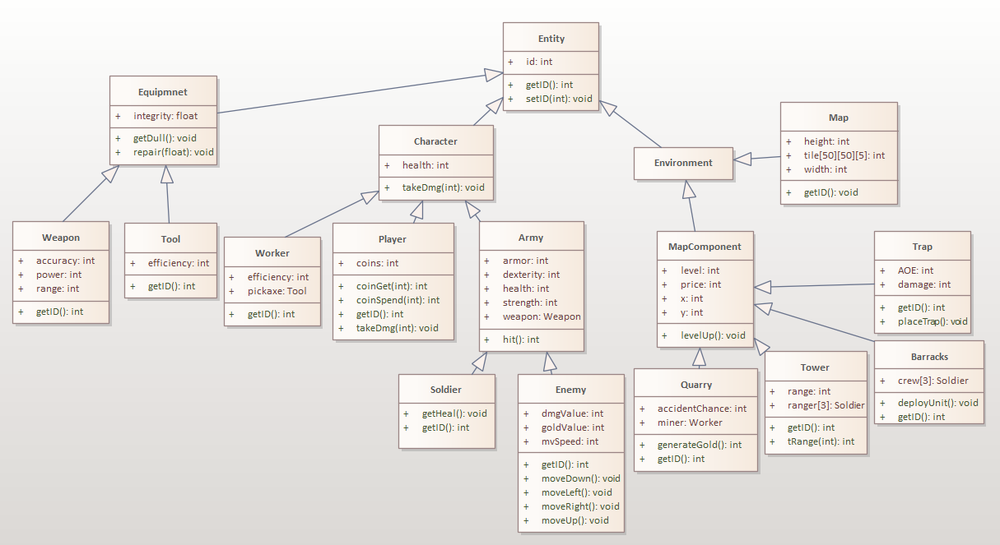

# OOP Lab 3
## Inheritance

The common-to-all class is called `Entity` which has the `id` attribute, the `setID` function and the virtual `getID` function. From it derive 3 subclasses called `Equipment`, `Character` 
and `Evironment`. All the above classes are abstract since they all inherit the virtual `get ID` function.

From the `Equipment` class, derive two instantiable subclasses `Weapon` and `Tool`.

From `Character` derive the instantiable `Player` and `Worker` classes, and the abstract `Army` class.
From `Army` derive `Soldier` and `Enemy`.

The `Environment` class has no attributes or methods of its own since it is only used to group its subclasses.

From it derive the instantiable `Map` class and the abstract `MapComponent` class.

From the latter derive `Quarry`, `Tower`, `Barracks` and `Trap` which are instantiable classes.
